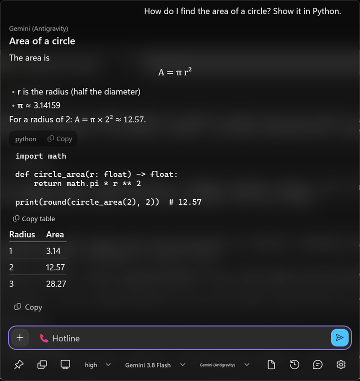
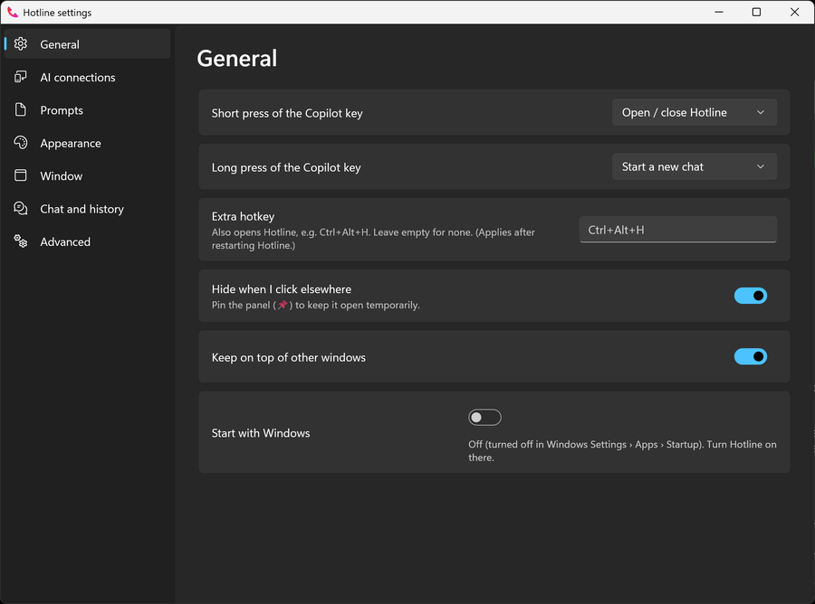

# Hotline

**You are stuck with the key might as well use it. Gives you an option to replace the Windows Copilot key with your own fast, native AI popup that talks to the AI *you* choose.**

Hotline uses the AI tools you already have (your
installed Claude Code or Antigravity CLI and their sign-ins) or any API key you bring, and keeps everything
configurable in plain files.

<p align="center">
  
</p>

> Status: pre-1.0 — used daily, expect rough edges. Windows 11 only. Apache-2.0.

## Features

- **The Copilot key** — short press opens/closes, long press starts a new chat (both configurable), plus an
  optional extra hotkey. Opens on the monitor you're working on, focused and ready to type.
- **Your choice of AI** — pick *Effort → Model → Provider* in the bar:
  - **Claude Code** (your Claude plan, no API key) and **Antigravity CLI / agy** (Gemini with your Google sign-in)
  - **Anthropic API**, **Gemini API**, **OpenAI-compatible** APIs (OpenAI, OpenRouter, …)
  - **Local models** through any OpenAI-style server (llama.cpp's `llama-server`, LM Studio, vLLM)
- **Native and light** — WinUI 3 with acrylic, no embedded webview2.
- **Rich answers** — Markdown with headings, lists, tables, code (with Copy), math (LaTeX → readable symbols), inline
  SVG drawings, and the whole conversation selectable in one drag.
- **Screens and files** — capture the window you were in, the whole screen, or a region you drag out; paste or drop
  images and files. Models that can't see images get the **text in the screenshot** instead (Windows' offline OCR).
- **Selected text comes along** — text you had selected in the app you came from is attached automatically (through
  UI Automation: no keystrokes, your clipboard untouched).
- **Quick actions** — type `/` for `/translate`, `/summarize`, `/fix`, `/explain`, or your own: each is a Markdown file
  in `actions\`.
- **Memory** — `/remember I prefer metric units` (or "remember that…" to an API model, which asks you first) saves a
  note to `memory.md`; every chat sees it, whichever AI you use.
- **Voice** — set the long press to *Voice input*, hold the key and talk; let go to stop.
- **Recent chats** — reopen the last chats from the 🕘 menu or with Ctrl+↑.
- **Effort control** for every AI that has it (Claude, Gemini's thinking level, OpenAI reasoning effort); rate limits
  are retried for you, and Settings › AI connections › *Test connection* checks a key and model.
- **Tools, carefully** — API connections can use tools from your **MCP servers** (`mcp.json`, the same format other
  MCP apps use) and, when your Windows has it, the built-in **Windows agent connectors**. Read-only tools run; anything
  else asks you in the panel (*Allow once / Always / Deny*). CLI connections can use their own tools under their own
  permission rules.
- **System prompts** as Markdown files you can switch from the bar.
- **Your bar, your way** — `toolbar.json` picks which buttons and pickers the bar shows, and in what order.
- **Everything is a file** — settings, one file per AI connection, prompts; edits apply instantly. API keys live in
  Windows Credential Locker.

<p align="center">
  
</p>

## Install

Windows 11 22H2 or later.

### From Releases

Download the latest `.msix` from [Releases](https://github.com/PMARC14/hotline/releases) and double-click it (Windows'
App Installer opens with an **Install** button). To get automatic updates instead, download `Hotline.appinstaller`
and open that.

> **Test builds** (pre-releases) are signed with a throwaway self-signed certificate, so Windows refuses them until
> you trust that build's `Hotline.cer` once (admin PowerShell, in the download folder):
> `Import-Certificate -FilePath .\Hotline.cer -CertStoreLocation Cert:\LocalMachine\TrustedPeople`.
> Each test build has its own certificate, and test builds don't update automatically. Trusted-signed releases
> need none of this.

Then assign the key: **Settings → Personalization → Text input → Customize Copilot key on keyboard → Custom →
Hotline**. (Windows only lets packaged apps take the Copilot key, which is why Hotline installs as a package.)

### From source

Requires the [.NET SDK 10.0.401+](https://dotnet.microsoft.com/download).

```powershell
git clone https://github.com/PMARC14/hotline
cd hotline
powershell -File scripts\dev-cert.ps1   # once: creates a self-signed certificate and trusts it for sideloading (UAC)
powershell -File scripts\install.ps1    # builds, signs and installs Hotline, then starts it in the tray
```

Then assign the key as above.

## Using it

- **Copilot key** — open/close. **Long press** — new chat (or *Voice input*: talk while you hold it). **Esc** hides,
  **Ctrl+N** new chat.
- **/** at the start of a message — quick actions (`/translate some text`, or `/summarize` with an attachment).
- **Selected text** in the app you came from shows up as a chip; remove it with its ✕ if you don't want it.
- **+** / bar buttons — attach files, capture the window you were in, the whole screen, or a region. Ctrl+V pastes images.
- **📌 Pin** keeps the panel open while you drag files in.
- **⚙ Settings** — AI connections, prompts, appearance, window size, history, folders.

### Connecting an AI

| Connection | You need |
|---|---|
| Claude Code | [Claude Code](https://claude.com/claude-code) installed and signed in (run `claude` once) |
| Antigravity (agy) | The [Antigravity CLI](https://antigravity.google/cli) installed and signed in (run `agy` once) |
| Anthropic / Gemini / OpenAI-compatible | An API key — Settings › AI connections › Add connection, paste the key, pick a model |
| Local | An OpenAI-style server running (e.g. `llama-server` on `http://127.0.0.1:8080`) |

Keys are only ever sent over https (plain http only to this PC).

### Configuration

All options, the file layout and the agy permission setup: **[docs/configuration.md](docs/configuration.md)**.

## What leaves your PC

Hotline has no server of its own and collects nothing. When you send a message, it goes to **the AI connection you
picked** (Anthropic, Google, OpenAI-style service, a local server, or your Claude Code / agy sign-in), together with:

- **attachments** in the message box — files, screenshots, and the **text you had selected** in the app you came from
  (it appears as a chip; remove it with ✕, or turn it off: Settings › Chat and history › Attach selected text);
- the **system prompt** and your **memory.md** notes (Settings › Chat and history › Memory);
- the **earlier messages** of the conversation, for context;
- **tool results**, when an API connection uses tools you allowed.

Nothing is sent until you press Enter (an App Action from Click to Do or a quick action from Windows sends at once, as
you asked it to). Voice uses Windows' own speech recognition (Microsoft's online service). OCR runs on your PC.
Chat history, settings and memory stay in `%USERPROFILE%\.hotline`; API keys stay in Windows Credential Locker and
only travel over https (plain http only to this PC). What each AI provider does with your data is set by its terms.
Full details: [PRIVACY.md](PRIVACY.md).

## Development

```powershell
dotnet test --project tests\Hotline.Core.Tests\Hotline.Core.Tests.csproj   # unit tests (Core)
powershell -File tests\smoke\smoke.ps1 [-Install]                         # end-to-end against the installed app
```

The smoke test drives the same inputs Windows uses (protocol links, Copilot key messages, the hotkey), renders a
scripted conversation off-screen and builds every settings page, then checks the log. It restores your settings.
Debug build: `scripts\install.ps1 -Configuration Debug` (verbose log, key-status line). Crash dumps (opt-in, admin):
`scripts\enable-crash-dumps.ps1`.

- **Layout:** `src/Hotline.Core` (UI-free logic: backends, settings, markdown, tools — fully unit-tested),
  `src/Hotline.App` (WinUI 3 app), `tests/`, `scripts/`, `docs/` (design spec, plans, handoff notes).
- **Contributors / new sessions:** start with [docs/HANDOFF.md](docs/HANDOFF.md).
- **Testing everything by hand:** [docs/TESTING.md](docs/TESTING.md).

### CI and releases

Every pull request and push to `main` is built and unit-tested (`.github/workflows/ci.yml`). Every code change merged
to `main` publishes a release with the `.msix`, `Hotline.cer` and `Hotline.appinstaller`
(`.github/workflows/release.yml`); until the signing secrets are set these are self-signed pre-release test builds.
Details, signing and winget: [docs/RELEASING.md](docs/RELEASING.md).

## Roadmap

Trusted signing (Store or Azure Trusted Signing) and one-click installs with automatic updates for the first public
release — see
[docs/RELEASING.md](docs/RELEASING.md) and [docs/HANDOFF.md](docs/HANDOFF.md).

<!-- Un-hide once GitHub Sponsors and Ko-fi are set up (see .github/FUNDING.yml).
## Support Hotline

Hotline is free, open source and made by one person, with no ads or tracking. If it saves you time, a donation keeps
it going: [GitHub Sponsors](https://github.com/sponsors/PMARC14) or [Ko-fi](https://ko-fi.com/pmarc14) (also in
Settings › About).
-->

## License

Apache-2.0 — see [LICENSE](LICENSE). Third-party components: [THIRD-PARTY-NOTICES.md](THIRD-PARTY-NOTICES.md)
(placeholder app icon from Microsoft's [Fluent Emoji](https://github.com/microsoft/fluentui-emoji), MIT).
